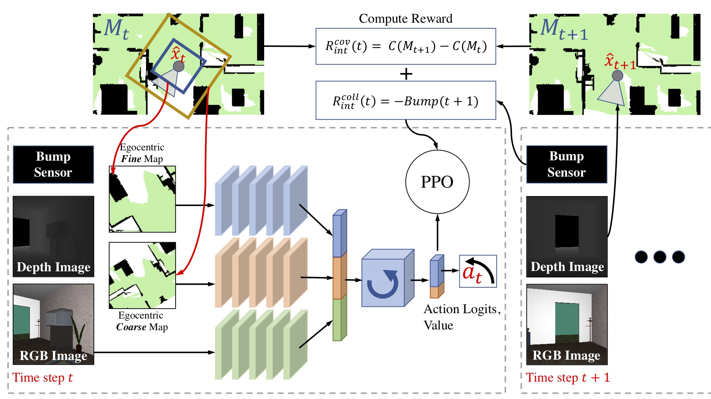

## Learning Exploration Policies for Navigation
#### In ICLR 2019 [[Project Website]](https://sites.google.com/view/exploration-for-nav/) [[Demo Video]](https://youtu.be/qenGbObEkOI) [[pdf]](https://openreview.net/pdf?id=SyMWn05F7)

 

If you find this code useful, please consider citing our work:

	@inproceedings{chen2018learning,
	  author = "Chen, Tao and Gupta, Saurabh and Gupta, Abhinav",
	  title = "Learning Exploration Policies for Navigation",
	  booktitle = "International Conference on Learning Representations",
	  year = "2019",
	  url = "https://openreview.net/pdf?id=SyMWn05F7"
	}

The code has been tested on **Ubuntu 16.04**.

#### Installation

**Folder Structure**

```bash
├── navigation
│   ├── suncg_data
│   ├── SUNCGtoolbox
│   └── exp4nav
```

1. Install dependencies
	```bash
	sudo apt-get install libglfw3-dev libglm-dev libx11-dev libegl1-mesa-dev libpng-dev
	sudo apt-get install libpng16-dev libjpeg9 libjpeg-dev build-essential pkg-config
	sudo apt-get install git curl wget automake libtool
	```

1. Install [Anaconda](https://www.anaconda.com/download/#linux)

1. Create a new virtual python environment
	```bash
	cd ~
	mkdir navigation
	cd ~/navigation
	git clone --recurse-submodules https://github.com/taochenshh/exp4nav.git
	cd exp4nav
	conda env create -f environment.yml
	conda activate exp4nav
	```

1. Download [SUNCG dataset](http://suncg.cs.princeton.edu/#), unzip it in **navigation**

1. Clone SUNCGtoolbox:
	```bash
	cd ~/navigation
	git clone  https://github.com/shurans/SUNCGtoolbox.git
	cd SUNCGtoolbox/gaps
	make clean 
	make
	```

1. Compile the render for House3D
	```bash
	cd ~/navigation/exp4nav/House3D/renderer
	SYSTEM=conda.linux PYTHON_CONFIG=/path/to/anaconda3/envs/exp4nav/bin/python3-config make -j
	```

1. Add House3D to PYTHONPATH
	```bash
	echo "export PYTHONPATH=$PYTHONPATH:~/navigation/exp4nav/House3D" >> ~/.bashrc
	source ~/.bashrc
	conda activate exp4nav
	```

1. Download trained models with IL and RL, pre-trained models with IL, and house id files

	```bash
	cd ~/navigation/exp4nav
	wget https://www.dropbox.com/s/q2d883k6eb2rvmg/path_data.tar.gz
	wget https://www.dropbox.com/s/z2cij8kjttilf7k/pretrain.tar.gz
	tar -xvzf path_data.tar.gz
	tar -xvzf pretrain.tar.gz
	```
    `map_only` and `map_rgb` are models trained with IL and RL. `il_map_only` and `il_map_rgb` are models trained with IL.


1. Preprocess SUNCG houses
	```bash
	cd ~/navigation/exp4nav/src/utils
	python env_remove_components.py
	```

1. Generate obj+mtl files for houses in EQA
	```bash
	cd ~/navigation/exp4nav/gutils
	python make_houses.py \
	    -eqa_path ../path_data/eqa_v1.json \
	    -suncg_toolbox_path ../../SUNCGtoolbox \
	    -suncg_data_path ../../suncg_data \
	    -hf_name house-no-doors
	cd ~/navigation/exp4nav/src/utils
	python preprocess_house.py
	```

#### Training:

```bash
cd ~/navigation/exp4nav/src

## IL+RL with Map+RGB
python main.py --lr=0.00001 --rnn_hidden_dim=128 --area_reward_scale=0.0005 --gamma=0.999 \
       --collision_penalty=0.006 --ent_coef=0.01  --train_rollout_repeat=2 --max_depth=3 \
       --num_steps=500 --il_pretrain --pretrain_dir=../pretrain/il_map_rgb/model  \
       --num_envs=8 --use_rgb_with_map   --save_dir=data/map_rgb --seed=1

## IL+RL with Map
python main.py --lr=0.00001 --rnn_hidden_dim=128 --area_reward_scale=0.0005 --gamma=0.999 \
       --collision_penalty=0.006 --ent_coef=0.01  --train_rollout_repeat=2 --max_depth=3 \
       --num_steps=500 --il_pretrain --pretrain_dir=../pretrain/il_map_only/model  --num_envs=8  \
       --save_dir=data/map_only --seed=1

## RL with Map+RGB
python main.py --lr=0.00001 --rnn_hidden_dim=128 --area_reward_scale=0.0005 --gamma=0.999 \
       --collision_penalty=0.006 --ent_coef=0.01  --train_rollout_repeat=2 --max_depth=3 \
       --num_steps=500 --num_envs=8   --use_rgb_with_map --save_dir=data/no_pretrain_map_rgb \
       --seed=1

## RL with Map
python main.py --lr=0.00001 --rnn_hidden_dim=128 --area_reward_scale=0.0005 --gamma=0.999 \
       --collision_penalty=0.006 --ent_coef=0.01  --train_rollout_repeat=2 --max_depth=3 \
       --num_steps=500 --num_envs=8   --save_dir=data/no_pretrain_map_only --seed=1
```

Add `--test` and change the number of parallel envs to 1 (`--num_envs=1`) to test the policies. Add `--render` in the end if you want to visually test the policy.

Note that the policy can be trained with RL only (without imitation learning). However, If you have some demonstration data, it will greatly increase the learning speed.


#### Testing on the pre-defined testing houses

```bash
cd ~/navigation/exp4nav/src

## IL+RL with Map+RGB
python test_policy.py --lr=0.00001 --rnn_hidden_dim=128 --area_reward_scale=0.0005 --gamma=0.999 \
       --collision_penalty=0.006 --ent_coef=0.01  --train_rollout_repeat=2 --max_depth=3 \
       --num_steps=1000 --il_pretrain --pretrain_dir=../pretrain/il_map_rgb/model  \
       --num_envs=8 --use_rgb_with_map   --save_dir=data/map_rgb --seed=1

## IL+RL with Map
python test_policy.py --lr=0.00001 --rnn_hidden_dim=128 --area_reward_scale=0.0005 --gamma=0.999 \
       --collision_penalty=0.006 --ent_coef=0.01  --train_rollout_repeat=2 --max_depth=3 \
       --num_steps=1000 --il_pretrain --pretrain_dir=../pretrain/il_map_only/model  --num_envs=8  \
       --save_dir=data/map_only --seed=1

## RL with Map+RGB
python test_policy.py --lr=0.00001 --rnn_hidden_dim=128 --area_reward_scale=0.0005 --gamma=0.999 \
       --collision_penalty=0.006 --ent_coef=0.01  --train_rollout_repeat=2 --max_depth=3 \
       --num_steps=1000 --num_envs=8   --use_rgb_with_map --save_dir=data/no_pretrain_map_rgb \
       --seed=1

## RL with Map
python test_policy.py --lr=0.00001 --rnn_hidden_dim=128 --area_reward_scale=0.0005 --gamma=0.999 \
       --collision_penalty=0.006 --ent_coef=0.01  --train_rollout_repeat=2 --max_depth=3 \
       --num_steps=1000 --num_envs=8   --save_dir=data/no_pretrain_map_only --seed=1

```

#### Plot Performance

```bash
cd ~/navigation/exp4nav/src
python performance_plot.py --data_dir=./data
```